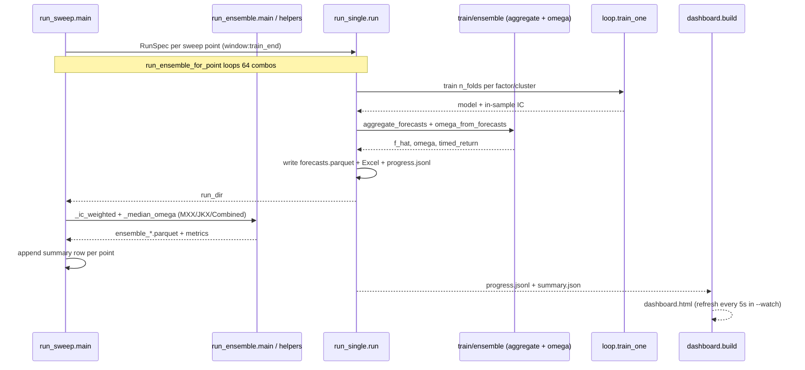

# Workflow runners

## Overview
The `factor_timing.cli` package contains the operational entrypoints for the project. Most workflows are meant to be run with `python -m ...` from the repository root. The three CLI runners form a layered orchestration: `run_single` is the atomic unit, `run_ensemble` (CLI) loops the 64 combos and reuses `run_single`, and `run_sweep` reuses both `run_single` and the `run_ensemble` (CLI) helper functions.

## Single-run training
### `factor_timing.cli.run_single`
Purpose:
- train one configuration across factors and seed folds,
- log progress to `progress.jsonl` (appended after every fold so the dashboard can tail it),
- emit `forecasts.parquet`, `summary.json`, and a T2_Optimizer-style Excel workbook.

What it uses:
- `FactorImageDataset` from `train/dataset.py`,
- `train_one()` from `train/loop.py`,
- model builders (`_build_model`), `aggregate_forecasts`, `omega_from_forecasts`, and `FoldResult` from `train/ensemble.py`.

Notable defaults from the source (`RunSpec`):
- panel `t2`, window `12`, arch `cnn`, image `mxx`, loss `mse`, weight `weight_ew`, target `raw`
- `n_folds=5`, `train_end=2018-12-31`, `val_frac=0.15`
- `max_epochs=200`, `patience=15`, `batch_size=256`

Split derivation in `run`: it reads `cache_{panel}_w{window}/index.parquet`, finds the date at the `(1 - val_frac)` quantile of pre-`train_end` dates as `val_start`, and treats `train_end` as `val_end`; test runs from `val_end` to the end of series.

Why it matters:
- this is the core atomic unit that other runners reuse, and it owns the Excel writer `_write_excel` (pivoting into `Monthly_Net_Returns`, `Omega_Weights`, `Expected_Return` sheets, converting month-end forecast dates to first-of-month to match the optimizer convention).

## Ensemble aggregation (CLI)
### `factor_timing.cli.run_ensemble`
Purpose:
- run all 64 `(arch, image, loss, weight, target)` combinations for one `(panel, window)` pair by calling `run_single` per combo,
- aggregate the forecasts into MXX-only, JKX-only, and combined ensembles,
- write `manifest.json` (incremental), per-ensemble parquet, and Excel outputs.

Important behavior:
- IC weights are the mean in-sample training IC across folds and factors for each combo (`ic_train_mean`); combos with non-positive or NaN IC are skipped by `_ic_weighted`.
- cross-sectional `omega` normalization uses median shifting so each month's median `omega = 1` (`_median_omega`).
- the `manifest.json` is written after each combo so partial runs survive interruption.
- ensemble-level metrics (OOS IC, HML Sharpe) are logged to the manifest and (if W&B is active) as a final aggregation run.

This CLI duplicates `_median_omega` and `_ic_weighted` rather than reusing `train/ensemble.omega_from_forecasts`/`aggregate_forecasts`; keep both copies in sync when changing omega/IC-weighting logic.

## Hyperparameter sweeps
### `factor_timing.cli.run_sweep`
Purpose:
- run one or more `window:train_end` points (passed as `w12:2023-03-31` style strings),
- execute the full 64-combo ensemble at each point via `run_ensemble_for_point`,
- write a rolling `summary.csv` after each point and a final `summary.xlsx` with per-ensemble pivots.

This is the widest orchestration mode in the repo and is useful when comparing lookback windows and train cutoffs under one consistent evaluation harness. It imports the `run_ensemble` (CLI) helpers `_combos`, `_combo_key`, `_ic_weighted`, `_median_omega`, `DATA_ROOT`, and `_write_excel`, plus `RunSpec`, `run`, and `RUNS_ROOT` from `run_single`.

The sweep runner's `_strategy_metrics()` function computes, for each `window:train_end` point and per ensemble (mxx/jkx/combined):
- `n_months`, `n_factors`
- `avg_month_IC` (mean monthly Pearson IC of `f_hat` vs `label_return`)
- `rank_IC`
- `baseline_ret%` and `baseline_Sharpe` (equal-weight monthly mean)
- `HML_ret%`, `HML_Sharpe`, `HML_t` (top-minus-bottom quintile on `omega`, annualized `*sqrt(12)`)
- `Top3_long_ret%`, `Top3_long_Sharpe`, `Top3_long_t`
- `LS3_ret%`, `LS3_Sharpe`, `LS3_t` (Top-3 long / Bottom-3 short spread)
- `Top15_long_ret%`, `Top15_long_Sharpe`, `Top15_long_t`

Each Sharpe tuple also reports a t-stat (`mean / (std / sqrt(n))`) and the annualized return (`mean * 12`).

## Dashboard generation
### `factor_timing.dashboard.build`
Purpose:
- read a run directory,
- summarize progress metrics (fits done / total, ETA from median `wall_s`, mean IC),
- generate a self-contained HTML dashboard with a training-IC bar chart, val-loss histogram, wall-time histogram, and a recent-fits table,
- optionally refresh every `REFRESH_SECONDS` (5) via a `<meta http-equiv="refresh">` tag in watch mode.

The dashboard expects `progress.jsonl` and `summary.json` in a run directory and is useful for monitoring long training jobs. It uses Plotly (`plotly.graph_objects`, `plotly.io`) and writes a single `dashboard.html` inside the run dir.

## Output conventions
Most runners write under `factor_timing/outputs/`:
- `cache_{panel}_w{window}/` for JKX cache, index, targets,
- `cache_{panel}_w{window}_mxx/` for MXX trajectory cache,
- `runs/<run_id>/` for per-run artifacts,
- `runs/ENSEMBLE_<group>/` for aggregated ensemble outputs,
- `sweeps/<sweep_id>/` for cross-point summaries.

See [Outputs and operational caveats](../operations/outputs-and-caveats.md) for the full layout and environment-specific path caveats.

## Operational caveats
- Several runners embed absolute Dropbox paths for source spreadsheets and output workbooks (e.g. `MONTHLY_PANEL` and `DATA_ROOT` defaults in `run_single.py`; `OHLC_PARQUET` defaults in the cache builders; the `pattern.imaging.renderer` `sys.path` insert in `build_cache.py`).
- `WANDB_API_KEY` controls whether W&B logging is active; the import is also guarded.
- The repo currently has no packaging metadata, so runners assume the working directory is the repo root.
- Some docstrings mention paths or file names that no longer match the current tree; the source code is the more reliable reference (see [Outputs and operational caveats](../operations/outputs-and-caveats.md)).
